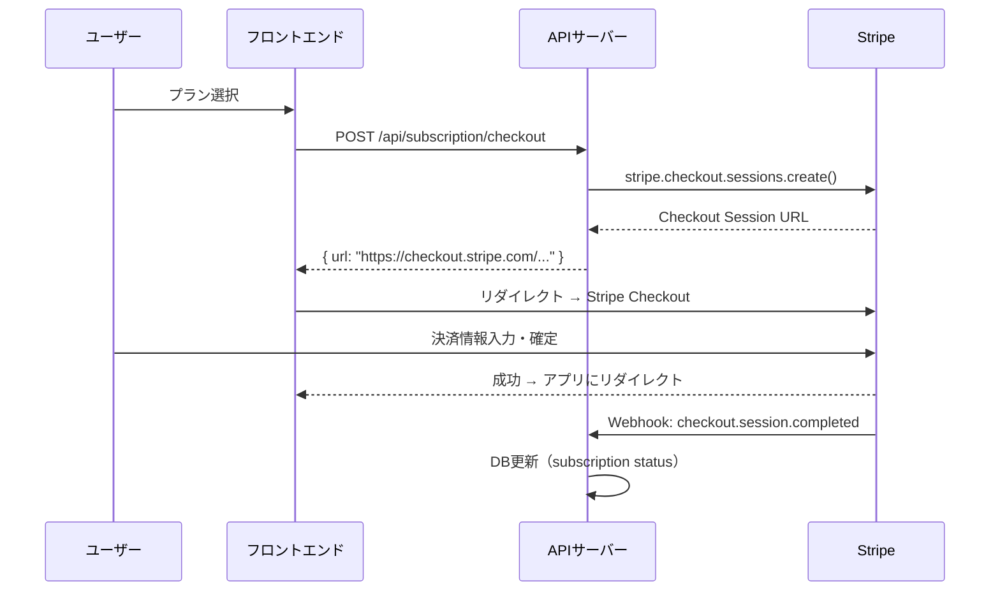

# AiZumen - 開発ベストプラクティス

> **作成日**: 2026-03-01  
> **対象**: Supabase + Express + React + Stripe によるSaaS開発

---

## 1. プロジェクト構成

### 1.1 ディレクトリ構成原則

```
AiZumen/
├── client/          # フロントエンド（React + Vite）
├── server/          # バックエンドAPI（Express）
├── supabase/        # Supabase設定・マイグレーション
├── scripts/         # 運用スクリプト
├── docs/            # ドキュメント
├── .env.example     # 環境変数テンプレート
└── .gitignore
```

- **monorepo構成**だが、client/server は独立してビルド・デプロイ可能にする
- `node_modules` はそれぞれに配置（workspaces不使用）
- 共有型定義が必要になった場合は `shared/` ディレクトリを検討

### 1.2 命名規則

| 対象 | 規則 | 例 |
|------|------|-----|
| ファイル（JS/JSX） | camelCase | `quotationService.js` |
| コンポーネント（JSX） | PascalCase | `QuotationForm.jsx` |
| DBテーブル | snake_case | `quotation_items` |
| DBカラム | snake_case | `created_at` |
| API Path | kebab-case | `/api/batch-delivery` |
| 環境変数 | SCREAMING_SNAKE | `SUPABASE_URL` |
| CSS クラス | TailwindCSS の命名に準拠 | `bg-blue-500` |

### 1.3 環境変数管理

```
.env.local          # ローカル開発（.gitignore対象）
.env.example         # テンプレート（Git管理）
.env.production      # 本番用メモ（値は空、.gitignore対象）
```

- **絶対にシークレットをコミットしない**
- クライアント用変数は `VITE_` プレフィックス必須（Viteの仕様）
- サーバー用シークレットは Railway の環境変数に直接設定

---

## 2. Supabase ベストプラクティス

### 2.1 認証（Supabase Auth）

```javascript
// ✅ Good: サーバーサイドでService Role Keyを使用
import { createClient } from '@supabase/supabase-js';
const supabaseAdmin = createClient(
  process.env.SUPABASE_URL,
  process.env.SUPABASE_SERVICE_ROLE_KEY
);

// ✅ Good: クライアントサイドではAnon Keyのみ
const supabase = createClient(
  import.meta.env.VITE_SUPABASE_URL,
  import.meta.env.VITE_SUPABASE_ANON_KEY
);
```

- **Service Role Key はサーバー側のみ**。クライアントに絶対に露出させない
- ユーザー作成時に `app_metadata` に `tenant_id` を埋め込む
- セッション管理は `supabase.auth.onAuthStateChange()` で監視

```javascript
// テナントIDをJWTに含める（サーバーサイド）
const { data, error } = await supabaseAdmin.auth.admin.createUser({
  email: 'user@example.com',
  password: 'secure-password',
  app_metadata: { tenant_id: tenantId, role: 'admin' }
});
```

### 2.2 Row Level Security (RLS)

```sql
-- ✅ Good: 全テナント別テーブルにRLSを有効化
ALTER TABLE quotations ENABLE ROW LEVEL SECURITY;

-- ✅ Good: テナント分離ポリシー
CREATE POLICY "tenant_isolation" ON quotations
  FOR ALL
  USING (tenant_id = (auth.jwt() -> 'app_metadata' ->> 'tenant_id')::UUID)
  WITH CHECK (tenant_id = (auth.jwt() -> 'app_metadata' ->> 'tenant_id')::UUID);

-- ✅ Good: ロールベースの制限を追加
CREATE POLICY "admin_only_delete" ON quotations
  FOR DELETE
  USING (
    tenant_id = (auth.jwt() -> 'app_metadata' ->> 'tenant_id')::UUID
    AND (auth.jwt() -> 'app_metadata' ->> 'role') = 'admin'
  );
```

> [!CAUTION]
> RLSを有効にした後、ポリシーなしだと**全行がアクセス不可**になる。テスト時に注意。

- **テスト方針**: 異なるテナントのJWTでクエリを実行し、他テナントのデータに触れないことを確認
- Service Role Key はRLSをバイパスする。管理操作以外で使用しない

### 2.3 データベース操作

```javascript
// ✅ Good: Supabase Client経由（RLSが自動適用）
const { data, error } = await supabase
  .from('quotations')
  .select('*, quotation_items(*), quotation_files(*)')
  .order('created_at', { ascending: false })
  .range(0, 19); // ページネーション

// ❌ Bad: 全件取得
const { data } = await supabase.from('quotations').select('*');
```

- **必ずページネーション**を使う（`.range(from, to)`）
- `select()` で必要なカラムのみ指定する
- リレーションは `select('*, child_table(*)')` で一括取得（N+1回避）
- エラーは必ずチェック: `if (error) throw error;`

### 2.4 Supabase Storage

```javascript
// ✅ Good: テナント別パスで保存
const storagePath = `${tenantId}/${quotationId}/${filename}`;
const { data, error } = await supabase.storage
  .from('quotation-files')
  .upload(storagePath, file, {
    contentType: file.type,
    upsert: false
  });

// ✅ Good: 署名付きURLで一時アクセス（60秒）
const { data } = await supabase.storage
  .from('quotation-files')
  .createSignedUrl(storagePath, 60);
```

- バケット名: `quotation-files`（ダッシュ区切り）
- パス構造: `{tenant_id}/{quotation_id}/{filename}`
- **公開バケットは使わない**。署名付きURLでアクセス制御
- ファイルサイズ上限はバケット設定で制御（20MB）

### 2.5 マイグレーション

```bash
# ローカルで開発
supabase migration new create_quotations_table
# → supabase/migrations/YYYYMMDDHHMMSS_create_quotations_table.sql

# ローカル環境に適用
supabase db reset

# リモート（本番）に適用
supabase db push
```

- マイグレーションファイルは**手戻りしたら新しいマイグレーションで修正**（既存ファイル編集禁止）
- 本番適用前に必ず `supabase db diff` で差分確認
- シードデータは `supabase/seed.sql` に配置

---

## 3. Express API ベストプラクティス

### 3.1 レイヤードアーキテクチャ

```
Routes (ルーティング)
  ↓
Controllers (入出力制御)
  ↓
Services (ビジネスロジック)
  ↓
Supabase Client (データアクセス)
```

```javascript
// routes/quotations.js - ルート定義のみ
router.get('/', authMiddleware, quotationController.list);
router.post('/', authMiddleware, quotationController.create);

// controllers/quotationController.js - 入出力制御
const list = async (req, res, next) => {
  try {
    const { page, status, search } = req.query;
    const result = await quotationService.list(req.tenantId, { page, status, search });
    res.json(result);
  } catch (err) {
    next(err);
  }
};

// services/quotationService.js - ビジネスロジック
const list = async (tenantId, { page = 1, status, search }) => {
  let query = supabase
    .from('quotations')
    .select('*, quotation_items(*)', { count: 'exact' });

  if (status) query = query.eq('status', status);
  if (search) query = query.ilike('company_name', `%${search}%`);

  const from = (page - 1) * PAGE_SIZE;
  const { data, count, error } = await query
    .order('created_at', { ascending: false })
    .range(from, from + PAGE_SIZE - 1);

  if (error) throw error;
  return { data, total: count, page, pageSize: PAGE_SIZE };
};
```

### 3.2 ミドルウェア設計

```javascript
// middleware/auth.js
const authMiddleware = async (req, res, next) => {
  const token = req.headers.authorization?.replace('Bearer ', '');
  if (!token) return res.status(401).json({ error: 'Unauthorized' });

  const { data: { user }, error } = await supabase.auth.getUser(token);
  if (error || !user) return res.status(401).json({ error: 'Invalid token' });

  req.user = user;
  req.tenantId = user.app_metadata?.tenant_id;
  req.userRole = user.app_metadata?.role;
  next();
};

// middleware/requireRole.js
const requireRole = (...roles) => (req, res, next) => {
  if (!roles.includes(req.userRole)) {
    return res.status(403).json({ error: 'Forbidden' });
  }
  next();
};

// middleware/checkCredits.js
const checkCredits = (amount) => async (req, res, next) => {
  const balance = await creditService.getBalance(req.tenantId);
  if (balance < amount) {
    return res.status(402).json({
      error: 'Insufficient AI credits',
      required: amount,
      balance
    });
  }
  req.creditCost = amount;
  next();
};
```

### 3.3 エラーハンドリング

```javascript
// utils/AppError.js
class AppError extends Error {
  constructor(message, statusCode, code) {
    super(message);
    this.statusCode = statusCode;
    this.code = code;         // 例: 'DUPLICATE_ORDER', 'CREDIT_EXHAUSTED'
    this.isOperational = true; // 運用上のエラー（バグではない）
  }
}

// middleware/errorHandler.js
const errorHandler = (err, req, res, next) => {
  console.error(`[${new Date().toISOString()}] ${err.message}`, {
    path: req.path,
    method: req.method,
    tenantId: req.tenantId,
    stack: err.stack
  });

  if (err.isOperational) {
    return res.status(err.statusCode).json({
      error: err.message,
      code: err.code
    });
  }

  // 予期しないエラーはユーザーに詳細を見せない
  res.status(500).json({ error: 'Internal server error' });
};
```

- **全APIハンドラを try/catch で囲む**か、express-async-errorsを使用
- ビジネスロジックのエラーは `AppError` で投げる
- スタックトレースは本番環境でクライアントに返さない

### 3.4 入力バリデーション

```javascript
// ✅ Good: サーバー側で必ずバリデーション
const createQuotation = async (req, res, next) => {
  const { companyName, items } = req.body;

  if (!companyName || typeof companyName !== 'string') {
    throw new AppError('Company name is required', 400, 'VALIDATION_ERROR');
  }

  if (!Array.isArray(items) || items.length === 0) {
    throw new AppError('At least one item is required', 400, 'VALIDATION_ERROR');
  }

  // 数値フィールドのサニタイズ
  const sanitizedItems = items.map(item => ({
    ...item,
    quantity: parseFloat(item.quantity) || 1,
    processing_cost: parseFloat(item.processingCost) || 0,
    material_cost: parseFloat(item.materialCost) || 0,
  }));
  // ...
};
```

- **クライアントのバリデーションはUX用**、サーバーのバリデーションはセキュリティ用
- 数値は `parseFloat` + fallback で安全に変換
- SQLインジェクションはSupabase Clientが自動対策（パラメタライズドクエリ）

---

## 4. React フロントエンド ベストプラクティス

### 4.1 状態管理

```javascript
// ✅ Good: React Context で認証状態とテナント情報を管理
const AuthContext = createContext(null);

export function AuthProvider({ children }) {
  const [user, setUser] = useState(null);
  const [session, setSession] = useState(null);
  const [loading, setLoading] = useState(true);

  useEffect(() => {
    // 初期セッション確認
    supabase.auth.getSession().then(({ data: { session } }) => {
      setSession(session);
      setUser(session?.user ?? null);
      setLoading(false);
    });

    // セッション変更の監視
    const { data: { subscription } } = supabase.auth.onAuthStateChange(
      (_event, session) => {
        setSession(session);
        setUser(session?.user ?? null);
      }
    );

    return () => subscription.unsubscribe();
  }, []);

  const value = {
    user,
    session,
    tenantId: user?.app_metadata?.tenant_id,
    userRole: user?.app_metadata?.role,
    loading,
    signIn: (email, password) => supabase.auth.signInWithPassword({ email, password }),
    signOut: () => supabase.auth.signOut(),
  };

  return <AuthContext.Provider value={value}>{children}</AuthContext.Provider>;
}
```

### 4.2 API通信

```javascript
// lib/api.js - 認証トークンを自動付加するAPIクライアント
import axios from 'axios';
import { supabase } from './supabase';

const api = axios.create({
  baseURL: import.meta.env.VITE_API_URL || 'http://localhost:3001',
});

// リクエストごとに最新トークンを付加
api.interceptors.request.use(async (config) => {
  const { data: { session } } = await supabase.auth.getSession();
  if (session?.access_token) {
    config.headers.Authorization = `Bearer ${session.access_token}`;
  }
  return config;
});

// 401エラー時にログイン画面へリダイレクト
api.interceptors.response.use(
  (response) => response,
  (error) => {
    if (error.response?.status === 401) {
      supabase.auth.signOut();
      window.location.href = '/login';
    }
    return Promise.reject(error);
  }
);

export default api;
```

### 4.3 コンポーネント設計

```javascript
// ✅ Good: 関心の分離
// hooks/useQuotations.js - データ取得ロジック
export function useQuotations({ page, status, search }) {
  const [data, setData] = useState({ items: [], total: 0 });
  const [loading, setLoading] = useState(true);
  const [error, setError] = useState(null);

  useEffect(() => {
    let cancelled = false;
    setLoading(true);

    api.get('/api/quotations', { params: { page, status, search } })
      .then(res => { if (!cancelled) setData(res.data); })
      .catch(err => { if (!cancelled) setError(err); })
      .finally(() => { if (!cancelled) setLoading(false); });

    return () => { cancelled = true; }; // クリーンアップ
  }, [page, status, search]);

  return { ...data, loading, error };
}
```

- **カスタムフック**でデータ取得・状態管理を分離
- コンポーネントはUI表示に集中
- `useEffect` のクリーンアップで**競合状態を防止**

### 4.4 ルーティング・ガード

```javascript
// components/ProtectedRoute.jsx
function ProtectedRoute({ children, requiredRole }) {
  const { user, loading, userRole } = useAuth();

  if (loading) return <LoadingSpinner />;
  if (!user) return <Navigate to="/login" />;
  if (requiredRole && userRole !== requiredRole) return <Navigate to="/quotations" />;

  return children;
}

// App.jsx
<Route path="/admin/*" element={
  <ProtectedRoute requiredRole="admin">
    <AdminLayout />
  </ProtectedRoute>
} />
```

---

## 5. Stripe 連携ベストプラクティス

### 5.1 基本原則

- **Stripeをデータのソースとする**: サブスクリプション状態はStripe Webhookから同期
- **Checkoutは Stripe Hosted Page を使う**: PCI DSS対応が不要になる
- **Webhookは冪等に設計**: 同じイベントが2回来ても問題ないようにする

### 5.2 サブスクリプションフロー



### 5.3 Webhook処理

```javascript
// routes/webhook.js
router.post('/api/webhooks/stripe',
  express.raw({ type: 'application/json' }), // JSONパース前の生データが必要
  async (req, res) => {
    const sig = req.headers['stripe-signature'];
    let event;

    try {
      event = stripe.webhooks.constructEvent(req.body, sig, WEBHOOK_SECRET);
    } catch (err) {
      return res.status(400).send(`Webhook Error: ${err.message}`);
    }

    // 冪等性チェック
    const existing = await checkProcessedEvent(event.id);
    if (existing) return res.json({ received: true, skipped: true });

    switch (event.type) {
      case 'checkout.session.completed':
        await handleCheckoutCompleted(event.data.object);
        break;
      case 'customer.subscription.updated':
        await handleSubscriptionUpdated(event.data.object);
        break;
      case 'customer.subscription.deleted':
        await handleSubscriptionDeleted(event.data.object);
        break;
      case 'invoice.payment_failed':
        await handlePaymentFailed(event.data.object);
        break;
    }

    await markEventProcessed(event.id);
    res.json({ received: true });
  }
);
```

> [!IMPORTANT]
> Webhook エンドポイントは `express.json()` ミドルウェアの**前に**登録する。生のリクエストボディが署名検証に必要。

### 5.4 テスト方法

```bash
# Stripe CLI でローカルテスト
stripe listen --forward-to localhost:3001/api/webhooks/stripe
stripe trigger checkout.session.completed
```

---

## 6. セキュリティベストプラクティス

### 6.1 認証・認可チェックリスト

- [ ] 全APIエンドポイントに認証ミドルウェア適用
- [ ] 管理者APIにロールチェック実装
- [ ] RLS有効化・全テーブルにポリシー設定
- [ ] Service Role KeyはサーバーのみでRLS管理操作専用に使用
- [ ] JWTの有効期限を適切に設定（推奨: 1時間）
- [ ] リフレッシュトークンのローテーション有効化

### 6.2 ファイルアップロードの安全対策

```javascript
// ✅ Good: サーバー側でMIMEタイプとサイズを検証
const ALLOWED_TYPES = ['application/pdf', 'image/jpeg', 'image/png'];
const MAX_FILE_SIZE = 20 * 1024 * 1024; // 20MB

const validateFile = (file) => {
  if (!ALLOWED_TYPES.includes(file.mimetype)) {
    throw new AppError('Unsupported file type', 400, 'INVALID_FILE_TYPE');
  }
  if (file.size > MAX_FILE_SIZE) {
    throw new AppError('File too large (max 20MB)', 400, 'FILE_TOO_LARGE');
  }
};
```

- ファイル名はサーバー側で再生成（UUID + 拡張子）
- クライアントから渡されたファイル名をパスに直接使わない
- ストレージバケットのCORS設定を適切に制限

### 6.3 レート制限

```javascript
import rateLimit from 'express-rate-limit';

// 全APIに基本制限
app.use('/api/', rateLimit({
  windowMs: 15 * 60 * 1000, // 15分
  max: 100
}));

// OCR APIは厳格に制限
app.use('/api/ocr/', rateLimit({
  windowMs: 60 * 1000, // 1分
  max: 10
}));
```

---

## 7. パフォーマンスベストプラクティス

### 7.1 DBクエリ最適化

```javascript
// ✅ Good: 必要なカラムだけ取得
const { data } = await supabase
  .from('quotations')
  .select('id, company_name, status, created_at, quotation_items(name, quantity)');

// ❌ Bad: 全カラム取得
const { data } = await supabase.from('quotations').select('*');

// ✅ Good: カウントとデータを1クエリで
const { data, count } = await supabase
  .from('quotations')
  .select('*', { count: 'exact' })
  .range(0, 19);
```

### 7.2 フロントエンドパフォーマンス

- **React.memo** で再レンダリングを防止（特にリスト項目）
- **useMemo / useCallback** で重い計算・コールバックをメモ化
- PDFプレビューは**遅延読み込み**（Intersection Observer）
- 画像は**WebP形式** + lazy loading

### 7.3 ファイルアップロード最適化

```javascript
// ✅ Good: 並列アップロード（最大3並行）
const uploadFiles = async (files) => {
  const CONCURRENCY = 3;
  const results = [];

  for (let i = 0; i < files.length; i += CONCURRENCY) {
    const batch = files.slice(i, i + CONCURRENCY);
    const batchResults = await Promise.all(
      batch.map(file => uploadSingleFile(file))
    );
    results.push(...batchResults);
  }

  return results;
};
```

---

## 8. テスト方針

### 8.1 テストピラミッド

| レベル | ツール | 対象 | カバレッジ目標 |
|--------|-------|------|-------------|
| ユニット | Jest | Service層のビジネスロジック | 80% |
| 統合 | Jest + Supertest | APIエンドポイント | 主要フロー |
| E2E | ブラウザテスト | ユーザーフロー | 主要シナリオ |

### 8.2 テスト例

```javascript
// tests/services/quotationService.test.js
describe('QuotationService', () => {
  it('should create quotation with auto-generated ID', async () => {
    const result = await quotationService.create(testTenantId, {
      companyName: 'テスト株式会社',
      items: [{ name: '部品A', quantity: 10, processingCost: 1000 }]
    });
    expect(result.id).toMatch(/^Q\d{6}-\d{3}$/);
    expect(result.company_name).toBe('テスト株式会社');
  });

  it('should not access other tenant data', async () => {
    const result = await quotationService.list(otherTenantId, {});
    expect(result.data).toHaveLength(0);
  });
});
```

---

## 9. ログ・モニタリング

### 9.1 ログ形式

```javascript
// 構造化ログ
console.log(JSON.stringify({
  timestamp: new Date().toISOString(),
  level: 'info',
  message: 'Quotation created',
  tenantId: req.tenantId,
  quotationId: newId,
  userId: req.user.id
}));
```

- **本番ログはJSON形式**にする（パース可能にするため）
- テナントID・ユーザーIDを常に含める
- APIレスポンスタイムを計測・ログ出力

### 9.2 ヘルスチェック

```javascript
// GET /api/health
app.get('/api/health', async (req, res) => {
  try {
    const { error } = await supabase.from('tenants').select('id').limit(1);
    if (error) throw error;
    res.json({ status: 'ok', timestamp: new Date().toISOString() });
  } catch (err) {
    res.status(503).json({ status: 'error', message: err.message });
  }
});
```

---

## 10. Git運用

### 10.1 ブランチ戦略

```
main            ← 本番デプロイ対象
  └── develop   ← 開発統合ブランチ
       ├── feature/auth          ← 認証機能
       ├── feature/quotation-crud ← 見積CRUD
       └── fix/rls-policy        ← バグ修正
```

### 10.2 コミットメッセージ

```
feat: 見積一覧APIのページネーション対応
fix: RLSポリシーの権限漏れを修正
docs: 要件定義書のAIクレジット仕様を更新
refactor: quotationServiceのDB操作をSupabase Client化
chore: 依存パッケージのアップデート
```

### 10.3 .gitignore

```gitignore
# 環境変数
.env
.env.local
.env.production

# 依存
node_modules/

# ビルド
client/dist/

# Supabase
supabase/.temp/

# OS
.DS_Store
Thumbs.db

# IDE
.vscode/
.idea/
```

---

## クイックリファレンス: やってはいけないこと

| ❌ しないこと | ✅ 代わりにすること |
|-------------|-----------------|
| Service Role Key をクライアントに露出 | サーバーサイドでのみ使用 |
| RLSなしでテーブルを公開 | 全テーブルにRLS + ポリシー |
| クライアント入力をそのままDBに挿入 | サーバー側でバリデーション |
| `select('*')` で全カラム取得 | 必要なカラムのみ指定 |
| ページネーションなしの全件取得 | `.range()` で制限 |
| 機密情報のコンソール出力 | 構造化ログ（IDのみ） |
| Stripeの署名検証なしでWebhook処理 | `constructEvent()` で必ず検証 |
| ファイル名をそのままパスに使用 | UUID再生成 + 拡張子 |
| エラー詳細をクライアントに返す | 汎用メッセージ + 内部ログ |
