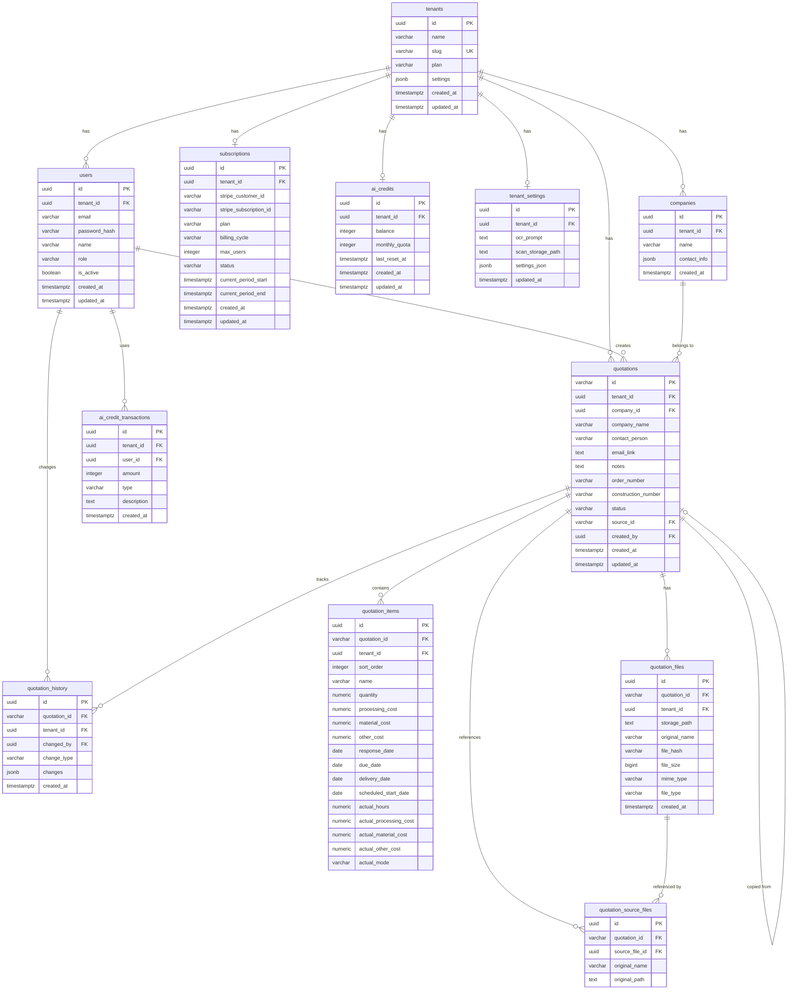

# AiZumen - データベース設計書

> **作成日**: 2026-03-01  
> **基盤**: Supabase PostgreSQL + Row Level Security

---

## ER図



---

## テーブル詳細

### tenants - テナント管理
企業単位の契約母体。

| カラム | 型 | 制約 | 説明 |
|--------|-----|------|------|
| id | UUID | PK, DEFAULT gen_random_uuid() | |
| name | VARCHAR(255) | NOT NULL | 企業名 |
| slug | VARCHAR(100) | UNIQUE, NOT NULL | URLスラグ |
| plan | VARCHAR(50) | DEFAULT 'small' | small/medium/large |
| settings | JSONB | DEFAULT '{}' | テナント固有設定 |
| created_at | TIMESTAMPTZ | DEFAULT NOW() | |
| updated_at | TIMESTAMPTZ | DEFAULT NOW() | |

### users - ユーザー管理
Supabase Auth の `auth.users` と連携。

| カラム | 型 | 制約 | 説明 |
|--------|-----|------|------|
| id | UUID | PK | Supabase Auth user IDと同一 |
| tenant_id | UUID | FK → tenants(id), NOT NULL | |
| email | VARCHAR(255) | NOT NULL | |
| name | VARCHAR(255) | NOT NULL | |
| role | VARCHAR(50) | DEFAULT 'user' | admin/user/viewer |
| is_active | BOOLEAN | DEFAULT true | |
| created_at | TIMESTAMPTZ | DEFAULT NOW() | |
| updated_at | TIMESTAMPTZ | DEFAULT NOW() | |
| | | UNIQUE(tenant_id, email) | |

> [!NOTE]
> パスワードハッシュはSupabase Auth側で管理するため、このテーブルには含めない。

### subscriptions - サブスクリプション
Stripeのサブスクリプション情報を同期。

| カラム | 型 | 制約 | 説明 |
|--------|-----|------|------|
| id | UUID | PK | |
| tenant_id | UUID | FK → tenants(id), NOT NULL | |
| stripe_customer_id | VARCHAR(255) | | Stripe顧客ID |
| stripe_subscription_id | VARCHAR(255) | | StripeサブスクリプションID |
| plan | VARCHAR(50) | NOT NULL | small/medium/large |
| billing_cycle | VARCHAR(20) | NOT NULL | monthly/yearly |
| max_users | INTEGER | NOT NULL | プランごとの上限 |
| status | VARCHAR(50) | DEFAULT 'active' | active/past_due/canceled/trialing |
| current_period_start | TIMESTAMPTZ | | 現在の請求期間開始 |
| current_period_end | TIMESTAMPTZ | | 現在の請求期間終了 |

### ai_credits - AIクレジット残高

| カラム | 型 | 制約 | 説明 |
|--------|-----|------|------|
| id | UUID | PK | |
| tenant_id | UUID | FK, UNIQUE | |
| balance | INTEGER | DEFAULT 0 | 現在の残高 |
| monthly_quota | INTEGER | DEFAULT 0 | 月間自動付与量 |
| last_reset_at | TIMESTAMPTZ | | 最終リセット日時 |

### ai_credit_transactions - クレジット履歴

| カラム | 型 | 制約 | 説明 |
|--------|-----|------|------|
| id | UUID | PK | |
| tenant_id | UUID | FK, NOT NULL | |
| user_id | UUID | FK → users(id) | |
| amount | INTEGER | NOT NULL | +購入 / -消費 |
| type | VARCHAR(50) | NOT NULL | usage/purchase/monthly_grant |
| description | TEXT | | 処理内容の説明 |

---

## RLSポリシー設計

全テナント別テーブルにRLSを有効化し、`auth.jwt() ->> 'tenant_id'` でフィルタリング。

```sql
-- 例: quotationsテーブル
ALTER TABLE quotations ENABLE ROW LEVEL SECURITY;

CREATE POLICY "tenant_isolation" ON quotations
    FOR ALL
    USING (tenant_id = (auth.jwt() ->> 'tenant_id')::UUID)
    WITH CHECK (tenant_id = (auth.jwt() ->> 'tenant_id')::UUID);
```

### RLS適用テーブル一覧
- `quotations`
- `quotation_items`
- `quotation_files`
- `quotation_source_files`
- `quotation_history`
- `companies`
- `ai_credits`
- `ai_credit_transactions`
- `tenant_settings`
- `users`（同一テナント内のみ参照可能）

---

## インデックス設計

```sql
-- 見積検索の高速化
CREATE INDEX idx_quotations_tenant ON quotations(tenant_id);
CREATE INDEX idx_quotations_status ON quotations(tenant_id, status);
CREATE INDEX idx_quotations_company ON quotations(tenant_id, company_name);
CREATE INDEX idx_quotations_order_number ON quotations(tenant_id, order_number);
CREATE INDEX idx_quotations_created ON quotations(tenant_id, created_at DESC);

-- 明細行
CREATE INDEX idx_items_quotation ON quotation_items(quotation_id);
CREATE INDEX idx_items_due_date ON quotation_items(tenant_id, due_date);
CREATE INDEX idx_items_delivery ON quotation_items(tenant_id, delivery_date);

-- ファイル
CREATE INDEX idx_files_quotation ON quotation_files(quotation_id);
CREATE INDEX idx_files_hash ON quotation_files(tenant_id, file_hash);

-- 履歴
CREATE INDEX idx_history_quotation ON quotation_history(quotation_id, created_at DESC);

-- クレジット履歴
CREATE INDEX idx_credit_tx_tenant ON ai_credit_transactions(tenant_id, created_at DESC);
```
