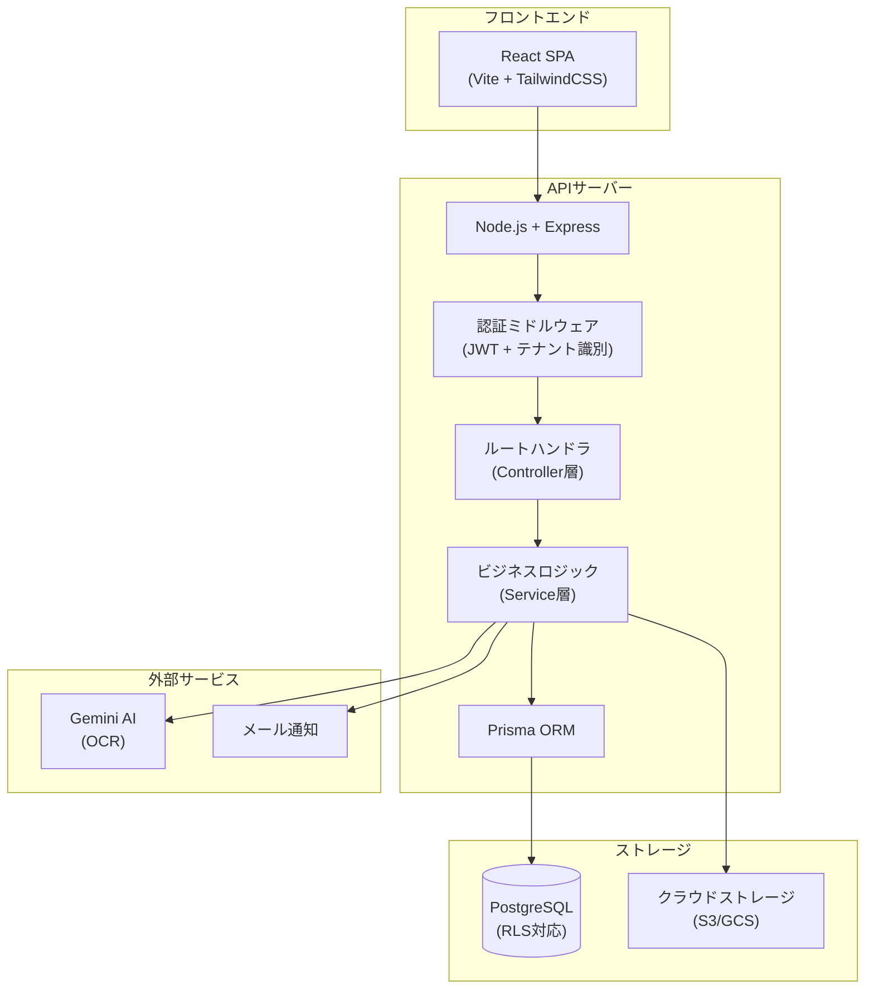
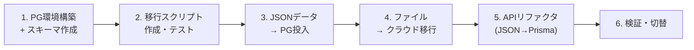

# Quotation Tool 現状分析 & PostgreSQL + SaaS化 推奨アーキテクチャ

## 1. 現在のシステム仕様

### 概要
正木鉄工向けの**見積・受注管理ツール**。製造業の受発注ワークフロー（見積依頼→見積回答→受注→作業→納品）を管理する社内向けWebアプリケーション。

### 技術スタック（現在）

| レイヤー | 技術 |
|---------|------|
| **フロントエンド** | React 19 + Vite 7 + TailwindCSS 4 |
| **バックエンド** | Node.js + Express 5 (単一ファイル `index.js` 1689行) |
| **データストア** | JSONファイル (`quotations.json`, `companies.json`) |
| **ファイルストレージ** | ローカルディスク (`uploads/`, `scanned_pool/`) |
| **AI/OCR** | Google Gemini API (注文書PDF→データ自動抽出) |
| **課金連携** | Google Cloud BigQuery / Monitoring API |
| **認証** | 単一パスワード認証 (環境変数) |

### 機能一覧

| # | 機能 | 説明 |
|---|------|------|
| 1 | **見積登録/編集** | 会社名・担当者・明細行・添付ファイルを含む見積書CRUD |
| 2 | **OCR自動登録** | Gemini AIでPDF/画像から注文データを自動抽出 |
| 3 | **スキャナプール** | ネットワークスキャナからのPDF自動取り込み・プレビュー・一括登録 |
| 4 | **PDFページ編集** | スキャンPDFのページ並べ替え・削除 |
| 5 | **注文書/図面分割** | 複数ページPDFを注文書(1P)と図面(2P以降)に自動分割 |
| 6 | **見積リスト表示** | フィルタリング・検索・ページネーション付き一覧 |
| 7 | **ステータス管理** | pending(見積中) → ordered(受注) → lost(失注) |
| 8 | **納品日管理** | 明細ごとの納品日入力・一括納品処理 |
| 9 | **実績入力** | 実作業時間・実加工費・実材料費の記録 |
| 10 | **見積コピー** | 既存見積をテンプレートとして新規作成（リピート品対応） |
| 11 | **変更履歴自動記録** | 更新時にnotesフィールドへ差分を自動追記 |
| 12 | **重複チェック** | 注文番号・ファイルハッシュによる重複検出 |
| 13 | **ガントチャート** | 予定/実績のスケジュール可視化 |
| 14 | **ダッシュボード** | 集計・分析ビュー |
| 15 | **見積印刷** | 見積書の印刷用ビュー |
| 16 | **スマート見積** | AI支援の見積作成 |
| 17 | **バックアップ/復元** | ZIPによる自動・手動バックアップ |
| 18 | **会社マスタ** | 取引先の自動登録・サジェスト |

### APIエンドポイント一覧

| Method | Path | 説明 |
|--------|------|------|
| `POST` | `/api/auth/login` | 管理者ログイン |
| `GET` | `/api/companies` | 会社一覧取得 |
| `GET` | `/api/quotations` | 全見積取得 |
| `POST` | `/api/quotations` | 見積新規作成 |
| `PUT` | `/api/quotations/:id` | 見積更新 |
| `DELETE` | `/api/quotations/:id` | 見積削除 |
| `POST` | `/api/quotations/batch-delivery` | 一括納品処理 |
| `POST` | `/api/backup` | バックアップ作成 |
| `GET` | `/api/backup/status` | バックアップ状態取得 |
| `GET` | `/api/backups` | バックアップ一覧 |
| `POST` | `/api/restore/:filename` | バックアップ復元 |
| `GET` | `/api/billing-usage` | GCP利用料取得 |
| `GET` | `/api/scanned-files` | スキャンプール一覧 |
| `GET` | `/api/scanned-files/count` | スキャンファイル数 |
| `DELETE` | `/api/scanned-files/:filename` | スキャンファイル削除 |
| `GET` | `/api/scanned-files/:filename/pages` | PDFページ数取得 |
| `POST` | `/api/scanned-files/:filename/reorder` | PDFページ並替 |
| `POST` | `/api/scanned-files/bulk-register` | 一括OCR登録 |
| `POST` | `/api/ocr` | 単体OCR処理 |

---

## 2. 現在のデータ構造

### Quotation (見積) オブジェクト

```json
{
  "id": "Q260228-001",           // 見積ID (QYYMMDD-XXX形式)
  "emailLink": "",               // メールリンク
  "companyName": "大同磨鋼材工業",  // 取引先名
  "contactPerson": "藤井",        // 担当者名
  "notes": "材料支給\n[変更履歴...]", // 備考＋自動変更履歴
  "orderNumber": "PO-2026-001",   // 注文番号
  "constructionNumber": "K-12345", // 工事番号
  "status": "ordered",            // ステータス: pending|ordered|lost
  "sourceId": "Q260115-003",      // コピー元見積ID (nullable)
  "sourceFiles": [],               // コピー元の添付ファイル情報
  "createdAt": "2026-02-04T04:45:14.275Z",
  "updatedAt": "2026-02-26T07:39:59.658Z",

  // レガシーフィールド（後方互換用）
  "filePath": "/uploads/xxx.pdf",
  "fileOriginalName": "xxx.pdf",

  // 添付ファイル配列
  "files": [
    {
      "id": "uuid-string",
      "path": "/uploads/timestamp-filename.pdf",
      "originalName": "注文書_example.pdf",
      "hash": "sha256-hash-string"       // 重複検出用
    }
  ],

  // 明細行配列
  "items": [
    {
      "id": "uuid-or-timestamp",
      "name": "部品名称",                  // 品名
      "quantity": 10,                      // 数量
      "processingCost": 3000,              // 加工費(見積)
      "materialCost": 200,                 // 材料費(見積)
      "otherCost": 0,                      // その他費用(見積)
      "responseDate": "2026-02-04",        // 回答日
      "dueDate": "2026-02-26",             // 納期
      "deliveryDate": "2026-02-26",        // 納品日
      "scheduledStartDate": "2026-02-10",  // 着手予定日
      "actualHours": 0.7,                  // 実作業時間
      "actualProcessingCost": 5600,        // 実加工費
      "actualMaterialCost": 0,             // 実材料費
      "actualOtherCost": 0,                // 実その他費用
      "_actualMode": "hours"               // 入力モード: hours|amount
    }
  ]
}
```

### Company (会社) データ
単純な文字列配列（ソート済み）:
```json
["大同磨工業", "大同磨鋼材工業", "御幸鉄工", "豊国工業"]
```

### Backup Status
```json
{
  "lastBackupDate": "2026-02-28T17:00:02.515Z",
  "lastBackupFile": "quotation-backup-2026-02-28T17-00-00-022Z.zip",
  "backupPath": "C:\\...\\backups\\quotation-backup-xxx.zip",
  "backupSize": 48433231
}
```

### フロントエンドコンポーネント構成

| コンポーネント | サイズ | 役割 |
|-------------|-------|------|
| `App.jsx` | 38KB | メインルーティング・状態管理 |
| `QuotationForm.jsx` | 70KB | 見積入力フォーム（最大コンポーネント） |
| `QuotationList.jsx` | 44KB | 見積一覧表示 |
| `AnalysisView.jsx` | 37KB | 分析・収益ダッシュボード |
| `SmartEstimator.jsx` | 27KB | AI支援見積 |
| `ScheduleGantt.jsx` | 19KB | ガントチャート |
| `ScannerPoolModal.jsx` | 15KB | スキャナプール管理 |
| `DeliveryBatchList.jsx` | 12KB | 納品一括処理 |
| `Dashboard.jsx` | 11KB | ダッシュボード |
| `PdfPageEditor.jsx` | 11KB | PDFページ編集 |
| `PdfThumbnail.jsx` | 5KB | PDFサムネイル |
| `QuotationPrintView.jsx` | 8KB | 印刷ビュー |

---

## 3. 現在のアーキテクチャの課題

| カテゴリ | 課題 |
|---------|------|
| **スケーラビリティ** | JSONファイル読み書きは全件ロード→全件書き込み。データ量増加でパフォーマンス劣化 |
| **同時アクセス** | ファイルロックなし。複数人同時編集でデータ競合・消失リスク |
| **マルチテナント** | シングルテナント設計。SaaS化には根本的な改修が必要 |
| **認証** | 全ユーザー単一パスワード。ユーザー識別・権限管理なし |
| **コード構造** | 1689行の単一ファイル。テストなし。保守困難 |
| **ファイル管理** | ローカルディスク依存。SaaS化にはクラウドストレージが必要 |
| **検索** | 全件メモリロード→フィルタリング。DB検索が必要 |

---

## 4. 推奨アーキテクチャ (PostgreSQL + SaaS)

### アーキテクチャ概要図



### 技術スタック（推奨）

| レイヤー | 現在 | 推奨 | 理由 |
|---------|------|------|------|
| **DB** | JSONファイル | **PostgreSQL** | ACID準拠・RLS・全文検索・JSON型 |
| **ORM** | fs.read/write | **Prisma** | 型安全・マイグレーション・マルチテナント対応 |
| **認証** | 単一パスワード | **JWT + bcrypt** | ユーザー別認証・テナント分離 |
| **ファイル** | ローカルディスク | **S3/GCS** | クラウネイティブ・CDN配信 |
| **API** | Express単一ファイル | **Express + Controller/Service層** | 関心の分離・テスタビリティ |
| **テスト** | なし | **Jest + Supertest** | API/ビジネスロジックの品質保証 |
| **デプロイ** | ローカルPC | **Docker + Cloud Run / Railway** | スケーラブル・管理不要 |

---

### PostgreSQL データベーススキーマ設計

```sql
-- ========================================
-- テナント管理
-- ========================================
CREATE TABLE tenants (
    id          UUID PRIMARY KEY DEFAULT gen_random_uuid(),
    name        VARCHAR(255) NOT NULL,        -- 例: '正木鉄工'
    slug        VARCHAR(100) UNIQUE NOT NULL,  -- URLスラグ
    plan        VARCHAR(50) DEFAULT 'free',    -- free|standard|premium
    settings    JSONB DEFAULT '{}',            -- テナント固有設定
    created_at  TIMESTAMPTZ DEFAULT NOW(),
    updated_at  TIMESTAMPTZ DEFAULT NOW()
);

-- ========================================
-- ユーザー管理
-- ========================================
CREATE TABLE users (
    id          UUID PRIMARY KEY DEFAULT gen_random_uuid(),
    tenant_id   UUID NOT NULL REFERENCES tenants(id),
    email       VARCHAR(255) NOT NULL,
    password_hash VARCHAR(255) NOT NULL,
    name        VARCHAR(255) NOT NULL,
    role        VARCHAR(50) DEFAULT 'user',    -- admin|user|viewer
    is_active   BOOLEAN DEFAULT true,
    created_at  TIMESTAMPTZ DEFAULT NOW(),
    updated_at  TIMESTAMPTZ DEFAULT NOW(),
    UNIQUE(tenant_id, email)
);

-- ========================================
-- 取引先マスタ
-- ========================================
CREATE TABLE companies (
    id          UUID PRIMARY KEY DEFAULT gen_random_uuid(),
    tenant_id   UUID NOT NULL REFERENCES tenants(id),
    name        VARCHAR(255) NOT NULL,
    contact_info JSONB DEFAULT '{}',           -- 連絡先情報
    created_at  TIMESTAMPTZ DEFAULT NOW(),
    UNIQUE(tenant_id, name)
);

-- ========================================
-- 見積テーブル（メイン）
-- ========================================
CREATE TABLE quotations (
    id              VARCHAR(20) PRIMARY KEY,   -- Q260228-001
    tenant_id       UUID NOT NULL REFERENCES tenants(id),
    company_id      UUID REFERENCES companies(id),
    company_name    VARCHAR(255) DEFAULT '',    -- 非正規化（検索用）
    contact_person  VARCHAR(255) DEFAULT '',
    email_link      TEXT DEFAULT '',
    notes           TEXT DEFAULT '',
    order_number    VARCHAR(100) DEFAULT '',
    construction_number VARCHAR(100) DEFAULT '',
    status          VARCHAR(20) DEFAULT 'pending'
                    CHECK (status IN ('pending','ordered','lost')),
    source_id       VARCHAR(20) REFERENCES quotations(id),  -- コピー元
    created_by      UUID REFERENCES users(id),
    created_at      TIMESTAMPTZ DEFAULT NOW(),
    updated_at      TIMESTAMPTZ DEFAULT NOW()
);

CREATE INDEX idx_quotations_tenant ON quotations(tenant_id);
CREATE INDEX idx_quotations_status ON quotations(tenant_id, status);
CREATE INDEX idx_quotations_company ON quotations(tenant_id, company_name);
CREATE INDEX idx_quotations_order_number ON quotations(tenant_id, order_number);
CREATE INDEX idx_quotations_created ON quotations(tenant_id, created_at DESC);

-- ========================================
-- 明細行テーブル
-- ========================================
CREATE TABLE quotation_items (
    id                    UUID PRIMARY KEY DEFAULT gen_random_uuid(),
    quotation_id          VARCHAR(20) NOT NULL REFERENCES quotations(id) ON DELETE CASCADE,
    tenant_id             UUID NOT NULL REFERENCES tenants(id),
    sort_order            INTEGER DEFAULT 0,
    name                  VARCHAR(500) DEFAULT '',
    quantity              NUMERIC(12,2) DEFAULT 1,
    processing_cost       NUMERIC(12,2) DEFAULT 0,      -- 見積加工費
    material_cost         NUMERIC(12,2) DEFAULT 0,       -- 見積材料費
    other_cost            NUMERIC(12,2) DEFAULT 0,       -- 見積その他
    response_date         DATE,                           -- 回答日
    due_date              DATE,                           -- 納期
    delivery_date         DATE,                           -- 納品日
    scheduled_start_date  DATE,                           -- 着手予定日
    actual_hours          NUMERIC(8,2) DEFAULT 0,         -- 実作業時間
    actual_processing_cost NUMERIC(12,2) DEFAULT 0,       -- 実加工費
    actual_material_cost  NUMERIC(12,2) DEFAULT 0,        -- 実材料費
    actual_other_cost     NUMERIC(12,2) DEFAULT 0,        -- 実その他
    actual_mode           VARCHAR(10) DEFAULT 'amount'    -- hours|amount
);

CREATE INDEX idx_items_quotation ON quotation_items(quotation_id);
CREATE INDEX idx_items_due_date ON quotation_items(tenant_id, due_date);
CREATE INDEX idx_items_delivery ON quotation_items(tenant_id, delivery_date);

-- ========================================
-- 添付ファイルテーブル
-- ========================================
CREATE TABLE quotation_files (
    id              UUID PRIMARY KEY DEFAULT gen_random_uuid(),
    quotation_id    VARCHAR(20) NOT NULL REFERENCES quotations(id) ON DELETE CASCADE,
    tenant_id       UUID NOT NULL REFERENCES tenants(id),
    storage_path    TEXT NOT NULL,                -- S3/GCSパス
    original_name   VARCHAR(500) NOT NULL,
    file_hash       VARCHAR(64),                  -- SHA256 (重複検出用)
    file_size       BIGINT,
    mime_type       VARCHAR(100),
    file_type       VARCHAR(20) DEFAULT 'attachment', -- attachment|po|drawing
    created_at      TIMESTAMPTZ DEFAULT NOW()
);

CREATE INDEX idx_files_quotation ON quotation_files(quotation_id);
CREATE INDEX idx_files_hash ON quotation_files(tenant_id, file_hash);

-- ========================================
-- コピー元ファイル参照テーブル
-- ========================================
CREATE TABLE quotation_source_files (
    id              UUID PRIMARY KEY DEFAULT gen_random_uuid(),
    quotation_id    VARCHAR(20) NOT NULL REFERENCES quotations(id) ON DELETE CASCADE,
    source_file_id  UUID REFERENCES quotation_files(id),
    original_name   VARCHAR(500),
    original_path   TEXT
);

-- ========================================
-- 変更履歴テーブル（notes埋め込みから分離）
-- ========================================
CREATE TABLE quotation_history (
    id              UUID PRIMARY KEY DEFAULT gen_random_uuid(),
    quotation_id    VARCHAR(20) NOT NULL REFERENCES quotations(id) ON DELETE CASCADE,
    tenant_id       UUID NOT NULL REFERENCES tenants(id),
    changed_by      UUID REFERENCES users(id),
    change_type     VARCHAR(50) NOT NULL,        -- created|updated|status_changed|...
    changes         JSONB NOT NULL,              -- 差分詳細
    created_at      TIMESTAMPTZ DEFAULT NOW()
);

CREATE INDEX idx_history_quotation ON quotation_history(quotation_id, created_at DESC);

-- ========================================
-- Row Level Security (テナント分離)
-- ========================================
ALTER TABLE quotations ENABLE ROW LEVEL SECURITY;
ALTER TABLE quotation_items ENABLE ROW LEVEL SECURITY;
ALTER TABLE quotation_files ENABLE ROW LEVEL SECURITY;
ALTER TABLE quotation_history ENABLE ROW LEVEL SECURITY;
ALTER TABLE companies ENABLE ROW LEVEL SECURITY;

-- ポリシー例（テナントIDでフィルタ）
CREATE POLICY tenant_isolation_quotations ON quotations
    USING (tenant_id = current_setting('app.tenant_id')::UUID);
```

### データマッピング（JSON → PostgreSQL）

| 現在のJSONフィールド | 移行先テーブル.カラム | 備考 |
|---------------------|---------------------|------|
| `id` | `quotations.id` | そのまま |
| `emailLink` | `quotations.email_link` | |
| `companyName` | `quotations.company_name` + `companies.name` | 正規化 |
| `contactPerson` | `quotations.contact_person` | |
| `notes` | `quotations.notes` | 変更履歴は`quotation_history`に分離 |
| `orderNumber` | `quotations.order_number` | |
| `constructionNumber` | `quotations.construction_number` | |
| `status` | `quotations.status` | |
| `sourceId` | `quotations.source_id` | |
| `createdAt` | `quotations.created_at` | |
| `updatedAt` | `quotations.updated_at` | |
| `items[].id` | `quotation_items.id` | UUIDに統一 |
| `items[].name` | `quotation_items.name` | |
| `items[].quantity` | `quotation_items.quantity` | |
| `items[].processingCost` | `quotation_items.processing_cost` | |
| `items[].materialCost` | `quotation_items.material_cost` | |
| `items[].otherCost` | `quotation_items.other_cost` | |
| `items[].responseDate` | `quotation_items.response_date` | DATE型に変換 |
| `items[].dueDate` | `quotation_items.due_date` | DATE型に変換 |
| `items[].deliveryDate` | `quotation_items.delivery_date` | DATE型に変換 |
| `items[].scheduledStartDate` | `quotation_items.scheduled_start_date` | DATE型に変換 |
| `items[].actualHours` | `quotation_items.actual_hours` | |
| `items[].actualProcessingCost` | `quotation_items.actual_processing_cost` | |
| `items[].actualMaterialCost` | `quotation_items.actual_material_cost` | |
| `items[].actualOtherCost` | `quotation_items.actual_other_cost` | |
| `items[]._actualMode` | `quotation_items.actual_mode` | |
| `files[].id` | `quotation_files.id` | |
| `files[].path` | `quotation_files.storage_path` | クラウドパスに変換 |
| `files[].originalName` | `quotation_files.original_name` | |
| `files[].hash` | `quotation_files.file_hash` | |
| `sourceFiles[]` | `quotation_source_files` | 別テーブルに正規化 |

### 推奨プロジェクト構造

```
quotation-saas/
├── docker-compose.yml
├── prisma/
│   ├── schema.prisma            # Prismaスキーマ定義
│   └── migrations/              # マイグレーション
├── server/
│   ├── src/
│   │   ├── index.js             # エントリポイント
│   │   ├── config/
│   │   │   └── database.js      # DB接続設定
│   │   ├── middleware/
│   │   │   ├── auth.js          # JWT認証
│   │   │   ├── tenant.js        # テナント識別
│   │   │   └── errorHandler.js  # エラーハンドリング
│   │   ├── routes/
│   │   │   ├── auth.js          # 認証API
│   │   │   ├── quotations.js    # 見積API
│   │   │   ├── companies.js     # 会社API
│   │   │   ├── files.js         # ファイルAPI
│   │   │   ├── ocr.js           # OCR API
│   │   │   └── admin.js         # 管理者API
│   │   ├── services/
│   │   │   ├── quotationService.js
│   │   │   ├── fileService.js
│   │   │   ├── ocrService.js
│   │   │   ├── historyService.js
│   │   │   └── backupService.js
│   │   └── utils/
│   │       ├── parsePrice.js
│   │       └── idGenerator.js
│   ├── tests/
│   └── package.json
├── client/
│   ├── src/
│   │   ├── components/          # 既存コンポーネント（流用可能）
│   │   ├── hooks/               # カスタムフック
│   │   ├── contexts/            # 認証・テナントContext
│   │   └── api/                 # API通信レイヤー
│   └── package.json
└── scripts/
    └── migrate-json-to-pg.js    # データ移行スクリプト
```

### SaaS化で追加すべき機能

| 機能 | 説明 |
|------|------|
| **テナント管理** | 会社ごとにデータ完全分離 (RLS) |
| **ユーザー管理** | メール+パスワード認証、役割(admin/user/viewer) |
| **JWT認証** | トークンベースのステートレス認証 |
| **プラン管理** | Free/Standard/Premium の機能制限 |
| **監査ログ** | 誰が・いつ・何を変更したかの記録 |
| **クラウドストレージ** | S3/GCS によるファイル管理 |
| **メール通知** | 納期アラート、ステータス変更通知 |

---

## 5. データ移行の考慮事項

> [!IMPORTANT]
> 現在のデータ（quotations.json: 184KB, 5244行）は実業務データです。移行スクリプトは十分にテストしてください。

### 移行時の注意点

1. **ID体系** - `items[].id`が`uuid`形式とタイムスタンプ数値(`1770181817430`)の両方が混在 → UUID統一が必要
2. **日付形式** - 空文字列`""`は`NULL`に変換
3. **数値型** - 浮動小数点(`444.44444...`)が存在 → NUMERIC型で精度管理
4. **文字化け** - `fileOriginalName`にmojibake文字あり → 可能な限り修復
5. **レガシーフィールド** - `filePath`, `fileOriginalName` は`files[]`配列に統合済みだが残存
6. **変更履歴** - `notes`フィールドに埋め込まれた履歴を`quotation_history`テーブルに分離するかどうかを検討
7. **テナントID** - 既存データは全て単一テナント（正木鉄工）に属する

### 移行手順（概要）


