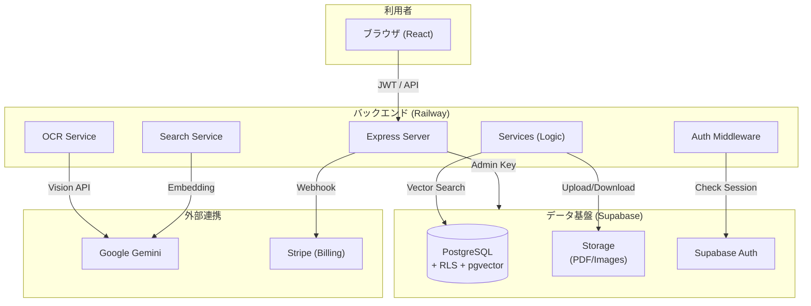

# AiZumen システムアーキテクチャ・設計解説書

本ドキュメントは、AiZumen（旧名: quotation-tool）のSaaS化移行後の現在のシステム構成、データフロー、および主要な技術的設計を解説するものです。

---

## 1. システム概要
製造業の見積・受注管理をデジタル化し、AIによる注文書OCRおよび図面類似検索を核としたSaaSアプリケーションです。

### 1.1 基本構成
| レイヤー | 技術スタック |
|---------|------|
| **フロントエンド** | React 19 + Vite 7 + TailwindCSS 4 |
| **バックエンド** | Node.js + Express 5 (Service/Controller分離構成) |
| **BaaS (Infrastructure)**| Supabase (PostgreSQL, Auth, Storage, Edge Functions) |
| **AI/検索** | Google Gemini 2.0 Flash + pgvector (Vector embeddings) |
| **決済・ライセンス** | Stripe (Subscription & Usage-based billing) |

---

## 2. アーキテクチャ図

---

## 3. 主要な設計方針

### 3.1 マルチテナント分離 (Row Level Security)
全テーブルにおいて `tenant_id` カラムを保持し、PostgreSQLの **RLS (Row Level Security)** を利用して他の企業（テナント）のデータが絶対に混ざらないよう厳格に分離されています。
*   JWTトークンに含まれる `tenant_id` を基に、データベースレベルでフィルタリングが行われます。

### 3.2 AI図面検索 (Vector Search)
`pgvector` 拡張を用い、アップロードされた図面をタイル状に分割・ベクトル化して保存しています。
1.  **ベクトル化**: MobileNetV2 等を用いて図面の特徴を 1280 次元のベクトルに変換。
2.  **類似検索**: コサイン類似度を用いて、過去の膨大な図面データから数秒以内に類似形状を特定。
3.  **再ランキング**: 上位候補を Gemini 2.0 Flash で精査し、最も近い図面と価格情報を提案。

### 3.3 ユーザーロールと権限
ユーザーの役割に応じた4段階のアクセス制御を行っています。
*   **super_admin**: プラットフォーム全体監視。
*   **system_admin**: 自テナントの全権、メンテナンスバイパス。
*   **admin**: 案件の作成・編集・削除など、通常業務のフルアクセス。
*   **user**: 参照専用。検索と閲覧のみ。

---

## 4. データモデル概要
主要なエンティティの相関関係です。

*   **Tenants**: 契約企業。プラン（Lite / Plus / Pro）やストレージ容量、AIクレジット枠を管理。
*   **Quotations**: 見積・受注の核となるデータ。案件、品目（Items）、図面・注文書（Files）が紐付く。
*   **Forum**: ユーザー間で知見を共有するためのコミュニティ基盤。
*   **AI Credits**: リクエスト単位、または月間付与枠でのAI利用管理。

---

## 5. 外部連携フロー

### 5.1 OCR自動インポート
1.  ユーザーがPDFをアップロード。
2.  Gemini 2.0 Flash が内容を読み取り、JSON形式で返却。
3.  サーバーが `Quotations` / `QuotationItems` に自動登録。

### 5.2 サブスクリプション管理
1.  Stripe でプラン契約またはクレジット購入。
2.  Webhook を通じて `subscriptions` / `ai_credits` テーブルをリアルタイム更新。
3.  ライセンス上限（ユーザー数など）に達した場合、新規登録を制限。

---

*最新更新: 2026-03-10*
