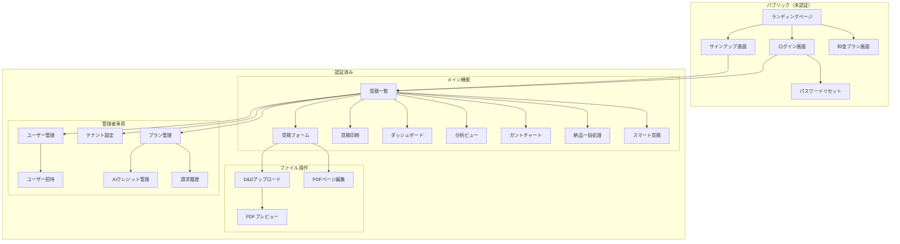

# AiZumen - 画面設計・画面遷移図

> **作成日**: 2026-03-01

---

## 画面遷移図



---

## 画面一覧

### パブリック画面

| # | 画面名 | パス | 説明 |
|---|--------|------|------|
| P1 | ランディングページ | `/` | サービス紹介・CTAボタン |
| P2 | ログイン | `/login` | メール/パスワードログイン |
| P3 | サインアップ | `/signup` | テナント + 管理者アカウント作成 |
| P4 | パスワードリセット | `/reset-password` | メールベースリセット |
| P5 | 料金プラン | `/pricing` | 3プランの比較表 |

### メイン画面（認証必須）

| # | 画面名 | パス | 説明 | 既存流用 |
|---|--------|------|------|---------|
| M1 | 見積一覧 | `/quotations` | 検索・フィルタ付き一覧 | QuotationList.jsx |
| M2 | 見積フォーム | `/quotations/new`, `/quotations/:id` | 見積の作成・編集 | QuotationForm.jsx |
| M3 | 見積印刷 | `/quotations/:id/print` | 印刷用ビュー | QuotationPrintView.jsx |
| M4 | ダッシュボード | `/dashboard` | 集計ビュー | Dashboard.jsx |
| M5 | 分析ビュー | `/analysis` | 収益分析 | AnalysisView.jsx |
| M6 | ガントチャート | `/schedule` | スケジュール可視化 | ScheduleGantt.jsx |
| M7 | 納品一括処理 | `/delivery` | 一括納品 | DeliveryBatchList.jsx |
| M8 | スマート見積 | `/smart-estimate` | AI支援見積 | SmartEstimator.jsx |

### ファイル操作（モーダル/サブ画面）

| # | 画面名 | 説明 | 既存流用 |
|---|--------|------|---------|
| F1 | D&Dアップロード | 複数ファイルドラッグ&ドロップ | ScannerPoolModal.jsx（改修） |
| F2 | PDFページ編集 | ページ並替・削除 | PdfPageEditor.jsx |
| F3 | PDFプレビュー | サムネイル表示。検索結果では指定範囲の5倍ズームを表示しコンテキストを強調。 | PdfThumbnail.jsx |

### 管理者画面（admin権限）

| # | 画面名 | パス | 説明 |
|---|--------|------|------|
| A1 | ユーザー管理 | `/admin/users` | ユーザー一覧・編集・無効化 |
| A2 | ユーザー招待 | `/admin/users/invite` | 招待メール送信 |
| A3 | テナント設定 | `/admin/settings` | AI解析プロンプト・保存先 |
| A4 | プラン管理 | `/admin/subscription` | 現在のプラン・変更 |
| A5 | AIクレジット管理 | `/admin/credits` | 残高確認・追加購入 |
| A6 | 請求履歴 | `/admin/billing` | 過去の請求一覧 |

---

## レイアウト構成

```
┌─────────────────────────────────────────────┐
│  ヘッダー                                      │
│  [ロゴ] [ナビ] [クレジット残高] [ユーザーメニュー] │
├─────────────────────────────────────────────┤
│                                              │
│  メインコンテンツエリア                          │
│                                              │
│  ┌──────────────────────────────────────┐   │
│  │                                      │   │
│  │   ページ固有コンテンツ                  │   │
│  │                                      │   │
│  └──────────────────────────────────────┘   │
│                                              │
├─────────────────────────────────────────────┤
│  フッター                                      │
│  [利用規約] [プライバシー] [お問い合わせ]         │
└─────────────────────────────────────────────┘
```

### ナビゲーション項目

| 項目 | パス | 表示条件 |
|------|------|---------|
| 見積一覧 | `/quotations` | 全ユーザー |
| ダッシュボード | `/dashboard` | 全ユーザー |
| スケジュール | `/schedule` | 全ユーザー |
| 分析 | `/analysis` | 全ユーザー |
| 管理 | `/admin/*` | admin のみ |

### ユーザーメニュー（ドロップダウン）

| 項目 | 説明 |
|------|------|
| プロフィール | ユーザー名・メール表示 |
| テナント名 | 所属企業名 |
| プラン | 現在のプラン名 |
| 設定 | 管理者設定へ（admin時） |
| ログアウト | |
